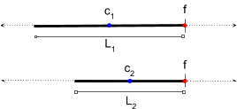

Consider a stick world where the "true" track state is parameterized with center _c_ and length _L_, but we observe tracks parameterized with the front point _f_ and the rear point _r_.


_H_ is the measurement matrix, which maps measurements onto state.

$$
\begin{aligned}
y = Hx
\end{aligned}
$$
$$
\begin{aligned}
\begin{bmatrix} f \\ r \end{bmatrix} &= 
\begin{bmatrix} c + L/2 \\ c - L/2 \end{bmatrix} =
\begin{bmatrix} 1 & 1/2 \\ 1 & -1/2 \end{bmatrix}
\begin{bmatrix} c \\ L \end{bmatrix} 
\end{aligned}
$$
$$
\begin{aligned}
H = \begin{bmatrix} 1 & 1/2 \\ 1 & -1/2 \end{bmatrix}
\end{aligned}
$$

A stationary track is proposed with very uncertain independent _c_ and _L_. 


Then, we observe an extremely confident estimate of _f_, but a highly uncertain estimate of _r_. 



We still update the track state _c_ and _L_ with high uncertainty. This is reasonable, e.g. we can’t tell the difference between whether the true state is $(c_1, L_1)$ or $(c_2, L_2)$.

**Question:**
- After we update with a very confident front observation, the center and length are still very uncertain. If we project the updated state back into the observation space, will the projected front point still be highly confident?


We assume the track is stationary and the prediction step yields no change, i.e. $x_t = x_{t-1}$ and $P_t = P_{t-1}$.

Using some real numbers in this example (rounded to nearest thousandth):

```python noLineNumbers
H = np.array([[1, 0.5], [1, -0.5]])

# The initial track has high uncertainty. It is centered at 0 and has length 2. 
# The prediction function is the identity.
x = np.array([0, 2])                                                                                               
P = np.array([[10, 0], [0, 10]])

# We observe the front point at 2, the rear point at -1.
# Our estimate of the front is very confident, but the rear is very uncertain.
y1 = np.array([2, -1])  
R1 = np.array([[0.001, 0], [0, 10]])

PH_T = np.matmul(P1, H.transpose())                                                                                 
K = np.matmul(PH_T, np.linalg.inv(np.matmul(H, PH_T) + R1)) 
array([[ 0.666,  0.222],
       [ 0.666, -0.444]])

# Our new state, updated with the observation, is still pretty uncertain.
x = x1 + np.matmul(K, y1 - np.matmul(H, x))
array([0.666, 2.666])

P = np.matmul((np.eye(2) - np.matmul(K, H)), P)
array([[ 1.111, -2.222],
       [-2.222,  4.445]])

# When we render the updated state back to the measurement frame,
# the high-confidence front emerges.
rendered_x = np.matmul(H, x)                                                                                                   
array([ 2.0, -0.667])

rendered_P = np.matmul(np.matmul(H, P), H.transpose())                                                                         
array([[0.001, 0.000],
       [0.000, 4.444]])

# We next observe the front point at 1, the rear point at -2.
# Our observation of the front is very uncertain, but the rear is very confident.
y2 = np.array([1, -2])  
R2 = np.array([[10, 0], [0, 0.001]])

PH_T = np.matmul(P, H.transpose()) 
K = np.matmul(PH_T, np.linalg.inv(np.matmul(H, PH_T) + R2))                                                        
array([[ 5e-05,  0.5],
       [ 1e-04, -1.0]])

# The updated state is very confident, now that both ends have been observed.
x = x + np.matmul(K, y2 - np.matmul(H, x))                                                                      
array([0, 4.0])

P = np.matmul((np.eye(2) - np.matmul(K, H)), P)                                                                  
array([[ 5e-04, 0    ],
       [ 0,     2e-03]])
```

#### We show that the projected front is still highly confident

After we update with a very confident front, the center and length estimate is still very uncertain. However, when we project the updated track state back into the observation space, the projected front point is highly confident.

The non-diagonal terms in the track state covariance reflect the strong (in this case, inverse) relationship between _c_ and _L_ given that we're confident about _f_.
Physically, the anti-correlation between the center and length means that to bring the center forward the length has to shrink and to move the center backward the length has to increase - both of which are consistent with having high certainty for the front observation.

**Consider the symmetric counterexample argument**: "We can't be very confident about _f_ because we are not confident about _r_, and the projection from the state space to the observation space for the front and rear points is symmetric."

However, although the rendering of the mean front and rear points is symmetric about the mean center, the rendering of the covariance is not symmetric. This can be seen in the `rendered_P` in the example above.

