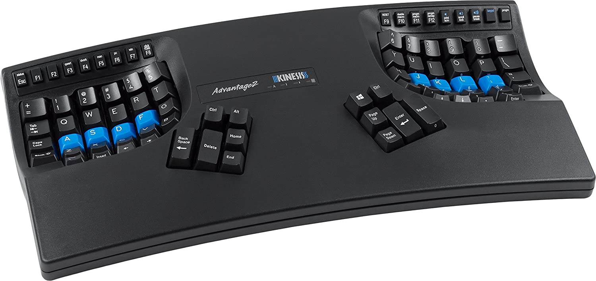
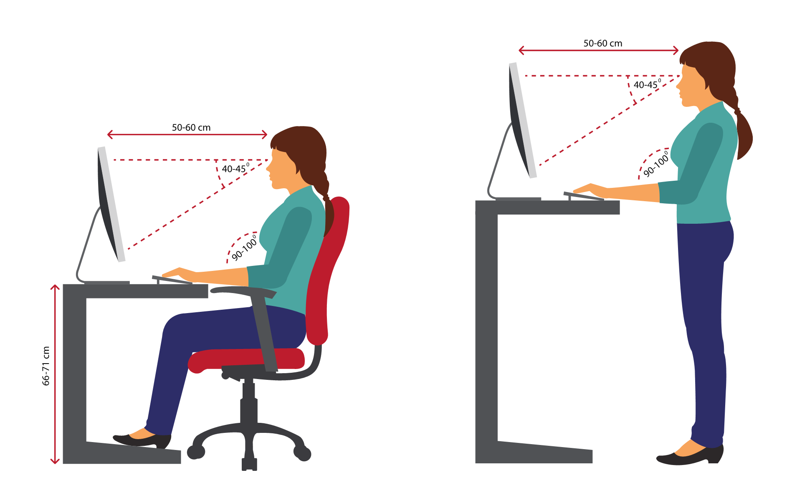

I started experiencing wrist pain in 2013, and it got increasingly worse over years.
One day around the end of 2017, my wrists hurt so much that I left work in the middle of the day to go see an orthopedic doctor.
Both of my wrists felt numb and tingling, with shooting pain up my forearms. It was obvious I had to do something about this.

#
#### What Worked

I compiled advice from doctors, coworkers, and friends - here's what worked for me, in impact order:

- **Kinesis ergonomic keyboard**

It took me about a week to get used to the Kinesis, but it has made the single biggest difference in my wrist pain. I know because whenever I use another keyboard, the wrist discomfort returns very quickly.

The split design and slightly curved key areas feel really comfortable.
I also remapped distant ring finger and pinky finger keys to the center thumb pads to minimize how much my hands need to spread.

- **Altering and avoiding mouse usage**

Because my right wrist hurt more often than the left, I figured my mouse habits were also part of the problem.
I developed some new habits:
rather than resting my wrist on the desk, I rest my palm on the mouse and leave my wrists in the air.
I also learned to use the mouse by moving my forearm instead of bending my wrist from side to side.
I switch my mouse between my right and left hands every couple of weeks or so.

I switched to vim to force myself to reduce mouse usage during code development and 
I also bought a smaller mouse to better fit my hand size (I use the Amazon Basics wireless mouse).

- **Break software**

I use [Workrave](https://workrave.org/) on my Linux machine to remind myself to take breaks.
I set a 30 second break every 20 minutes and a 5 minute break every hour.
During these breaks I stand up, shake my arms, and stretch. I also direct my gaze to a distant object to reduce eye strain.

It is very easy to get in the habit of ignoring break timers.
For this reason, I recommend configuring break timers to their strictest settings, e.g. locking your computer automatically for each break and blocking all input devices.

- **Desk ergonomics**

Some small tweaks to my desk ergonomics helped a lot. I kept a post-it note on my monitor to remind myself
about good sitting posture: forearms parallel to the ground, elbows at 90 degrees, and arms generally relaxed.

I also use a standing desk and stand at least a couple hours a day - I find that my work posture is especially
good when I'm standing, since I can't slouch into the backrest of my chair.

- **Ergonomic seating**

I removed the armrests of my chair because they tend to be too wide and I sometimes leaned into them while typing.
Some people like to remove backrests too to prevent slouching.

- **Hot compress**

I used a microwavable hot compress for short-term pain relief.

#
#### What Didn't Work

Here's what didn't work for me, but your mileage may vary:

- **Ergonomic mouse**: I tried all sorts of vertical and joystick mice but nothing worked as well as focusing on minimizing mouse usage altogether.

- **Wrist brace**: I bought a wrist brace because the light pressure relieves wrist pain,
and I was hoping it would help me learn to use the computer with minimal side-to-side wrist motion.
Unfortunately it was too uncomfortable to wear while typing.

- **Cold compress**: A cold compress or bag of frozen peas can help reduce inflammation and
works well for some other coworkers who experience RSI-related pain, but didn't help me much.

- **Anti-inflammatory medication**: This was recommended as another short-term solution for pain,
but I didn't notice any obvious improvements.

- **Wrist exercises**: I didn't do wrist exercises long enough to realize any potential benefit,
but I stopped because they increased my short-term discomfort and my doctors did not see wrist 
exercises help other patients consistently.

